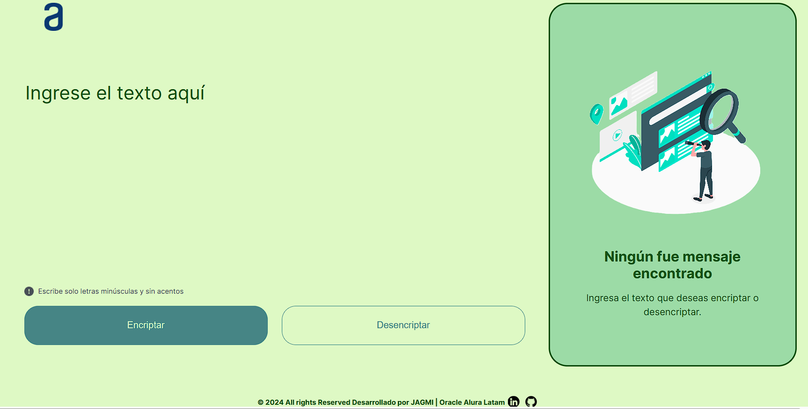

## Título 

Encriptador - Desencriptador de Texto.

## Descripción

Encriptador y desencriptador de texto creado con JavaScript, HTML y CSS para el challenge del Proyecto ONE de **Oracle+Alura LATAM**.

El funcionamiento de la página consiste escribir un mensaje en el área de texto, que la página lo encripte y presentarlo en su forma encriptada y luego ese mismo mensaje copiarlo y pegarlo para poder desencriptarlo. 
El objetivo de este desafio es poner a prueba los conocimientos adquiridos durante el curso "Principiante en programación"

## Código de Encriptación

Los códigos de encriptacion solicitados son:

- La letra "**a**" es convertida a "**ai**".
- La letra "**e**" es convertida a "**enter**".
- La letra "**i**" es convertida a "**imes**".
- La letra "**o**" es convertida a "**ober**"
- La letra "**u**" es convertida a "**ufat**"

---

## Requerimientos de funcionamiento

- Debe funcionar solo con letras minúsculas.
- No deben ser letras acentuadas ni caracteres especiales.
- Debe ser posible encriptar y desencriptar la frase escrita.
- El usuario deberá igresar el texto en el área de encriptación dar click al botón encriptar y se muestra el mensaje ya encriptado y viceversa.

### Extras:

- Agregamos un botón que copie el texto encriptado/desencriptado para la sección de transferencia, o sea que tenga la misma funcionalidad del ctrl+C o de la opción "copiar" del menú de las aplicaciones.

### Autor:
- Jorge Arturo Gómez Miguel  

